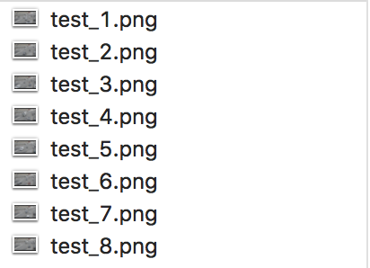
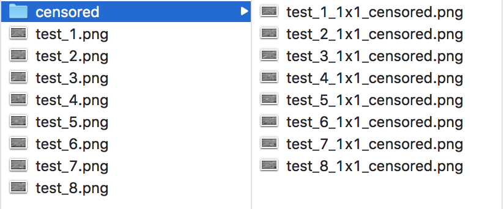

# openLPC

## open License Plate Censoring

openLPC is a tool based on openALPR and openCV to detect license plates and censoring them using gaussian blurring.

**IMPORTANT**
Increasing the matrix size > 1 will result in a faulty result. (WIP)

## Usage

### Modes

**There are three different modes (atm)**:

* `image`: censors a single image (provided by -path)
* `imagestack`: censors every image inside a given folder (provided by -path)
* `video`: censors a video file (provided by -path). To create a videofile as output pass `-output video` as argument

### Arguments

```
  -h, --help                show this help message and exit
  -msize MATRIX_SIZE        Size of the matrix
  -multiplier MULTIPLIER    Image/Frame mulitplied by given value
  -path FILEPATH            path to the file (for imagestack: path to the folder)
  -mode MODE                mode (image, imagestack, video)
  -output OUTPUT            output format (video, image)
  -show                     Display the output (screen required)
  -debug                    Debug mode (pink bar instead of blurred plate)
```

### openalpr.config

The `openalpr.config` file contains the configuration for **openALPR**

* `max_plate_width_percent` && `max_plate_height_percent` is set to 5 percent, to minimize false detections. (can be adjusted depending on the size of the license plate).
* `postprocess_min_confidence` is down to 40 percent. The information on the licence plate does not matter for the censoring.

### Examples:

##### Image:

`python openLPC.py -path /path/to/imagefile.jpg -mode image`

**input**:<br>


**output**:<br>


**output debug**:<br>


##### Imagestack:

`python openLPC.py -path /path/to/folder -mode imagestack`

**input**:<br>


**output**:<br>


##### Video:

`python openLPC.py -path /path/to/videofile.avi -mode video -output video`

**input**:<br>


**output**:<br>


### Licence

[AGPL](http://www.gnu.org/licenses/agpl-3.0.html)
